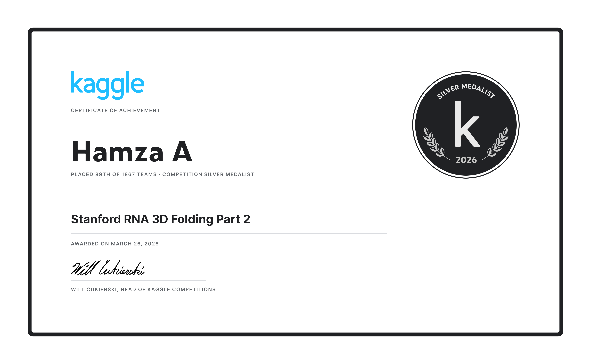
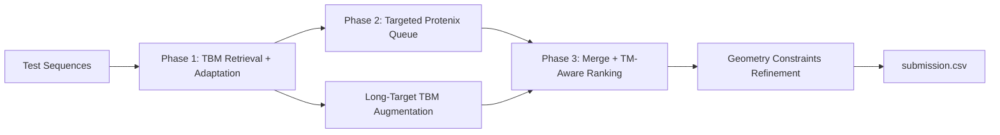

# RNX RNA-3D Pipeline

High-performance RNA 3D structure inference pipeline for the **Stanford RNA 3D Folding 2** competition.

This repository combines:
- template-based modeling (TBM),
- targeted Protenix inference,
- TM-aware candidate ranking,
- geometry-aware refinement and submission generation.

## Primary Notebook (Best RNX Version)

The current best notebook variant in this repo is:
- [`RNX_protenix_tm_tuned_parallel_push.ipynb`](./RNX_protenix_tm_tuned_parallel_push.ipynb)

Matching script export:
- [`RNX_protenix_tm_tuned_parallel_push.py`](./RNX_protenix_tm_tuned_parallel_push.py)

Key improvements in this version include runtime-budget-aware optional Protenix routing and stronger medium-length target handling.

## Pipeline Overview

## Repository Layout

- `RNX_protenix_tm_tuned_parallel_push.ipynb`: main competition notebook (recommended).
- `RNX_protenix_tm_tuned_parallel_push.py`: script-form source mirror of the main notebook.
- `RNX_protenix_tm_tuned.ipynb`: earlier tuned variant.
- `RNX_protenix_tm_tuned.py`: script mirror for the earlier tuned variant.
- `RNX_benchmark_0699_redeveloped.ipynb`: earlier benchmark redevelopment notebook.
- `generate_rnx_benchmark_notebook.py`: benchmark notebook generator.
- `generate_rnx_benchmark_notebook.ps1`: PowerShell benchmark notebook generation flow.
- `ref_rna3d_protenix.py`: reference extraction utilities used during development.
- `ref_tm_score_permutechains.py`: TM-score permutation reference utilities.
- `submission_blend_kabsch.py`: blend/geometry helper utility.

## Quick Start (Kaggle)

1. Create a Kaggle Notebook with GPU enabled.
2. Add notebook inputs:
- `stanford-rna-3d-folding-2` (competition dataset).
- Protenix dataset used by defaults (`qiweiyin/protenix-v1-adjusted` layout).
- wheel datasets for Biopython, Biotite, and RDKit.
3. Upload/open `RNX_protenix_tm_tuned_parallel_push.ipynb`.
4. Run all cells.
5. Submit `/kaggle/working/submission.csv`.

## Configuration

The notebook supports environment-variable tuning. Most important controls:
- `PROTENIX_MAX_SEQ_LEN`: skip Protenix for very long targets.
- `MAX_TBM_CANDS`: cap TBM candidates per target.
- `WEAK_TBM_PCT_THRESHOLD`: weak-TBM trigger for optional Protenix.
- `EXTRA_PROTENIX_MAX_TARGETS`: cap weak-target optional queue.
- `FORCE_MEDIUM_PROTENIX` and medium-length bounds:
`MEDIUM_PROTENIX_MIN_LEN`, `MEDIUM_PROTENIX_MAX_LEN`, `MEDIUM_PROTENIX_EXTRA_TARGETS`.
- Runtime budget controls:
`TARGET_TOTAL_RUNTIME_MIN`, `PHASE1_EXPECTED_SEC`, `PROTENIX_TIME_BUDGET_SEC`.

## Local Development

This project is primarily Kaggle-first, but local scripting support is included:
- install dependencies from `requirements.txt`,
- keep paths configurable via environment variables,
- use smaller test slices for fast iteration before full Kaggle reruns.

## Reproducibility

- Seed is fixed (`SEED = 42`).
- Candidate generation uses deterministic seed formulas.
- Output format matches competition submission schema.

## Disclaimer

Leaderboard performance depends on hidden evaluation targets and cannot be guaranteed.
