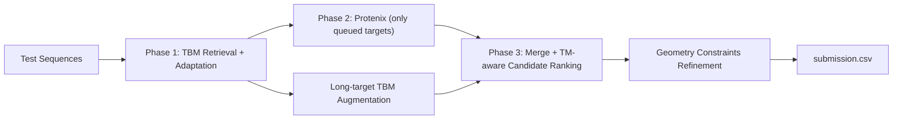

# RNX RNA-3D Pipeline

High-performance RNA 3D structure inference pipeline for the **Stanford RNA 3D Folding 2** competition, combining:

- template-based modeling (TBM),
- targeted Protenix inference,
- TM-aware ensemble selection,
- and geometry-aware post-processing.

The current primary artifact is [`RNX_protenix_tm_tuned.ipynb`](./RNX_protenix_tm_tuned.ipynb), with source mirrored in [`RNX_protenix_tm_tuned.py`](./RNX_protenix_tm_tuned.py).

## Why This Repo

This project is optimized for real Kaggle constraints:

- strong leaderboard-focused quality under strict runtime limits,
- robust behavior on very long targets,
- graceful fallback when optional model assets are unavailable.

## Pipeline Overview

### Phase 1: TBM

- Aligns test sequences against train/validation template pool.
- Applies template adaptation and diversity transforms.
- Uses configurable identity thresholds and relaxed long-sequence rescue.
- Skips Protenix for very long sequences to avoid chunk-runtime blowups.

### Phase 2: Protenix (Targeted)

- Runs only for targets still missing high-confidence candidates.
- Uses single-pass inference for manageable lengths.
- Supports chunking logic, but current tuned defaults prioritize stability.

### Phase 3: Ensemble + Refinement

- Merges TBM and Protenix candidates.
- Uses TM-proxy consensus + diversity-aware selection.
- Applies geometry constraints and writes Kaggle-compatible `submission.csv`.
- For long targets, fills missing slots using **TBM augmentation** before de-novo.

## Repository Layout

- `RNX_protenix_tm_tuned.ipynb`: main competition notebook.
- `RNX_protenix_tm_tuned.py`: script-form source of the tuned pipeline.
- `RNX_benchmark_0699_redeveloped.ipynb`: earlier benchmark redevelopment variant.
- `generate_rnx_benchmark_notebook.py`: generator for benchmark notebook.
- `generate_rnx_benchmark_notebook.ps1`: PowerShell notebook generation workflow.
- `ref_rna3d_protenix.py`: reference extraction used during development.
- `ref_tm_score_permutechains.py`: TM-score permutation reference utilities.

## Quick Start (Kaggle)

1. Create a Kaggle Notebook with GPU enabled.
2. Add required datasets/models as notebook inputs:
- `stanford-rna-3d-folding-2` (competition data)
- Protenix code/checkpoint dataset (`qiweiyin/protenix-v1-adjusted` path used in defaults)
- wheel datasets used by cell 1 (Biopython, Biotite, RDKit)
3. Upload and open `RNX_protenix_tm_tuned.ipynb`.
4. Run all cells.
5. Submit `/kaggle/working/submission.csv`.

## Configuration (Environment Variables)

The tuned pipeline is configurable via environment variables:

| Variable | Default | Purpose |
|---|---:|---|
| `MAX_SEQ_LEN` | `512` | Protenix max sequence length per pass. |
| `CHUNK_OVERLAP` | `128` | Overlap used when chunking is enabled. |
| `MIN_SIMILARITY` | `0.0` | Minimum normalized TBM similarity. |
| `MIN_PERCENT_IDENTITY` | `50.0` | Primary TBM identity threshold. |
| `MAX_TBM_CANDS` | `9` | Cap on TBM candidates per target. |
| `PROTENIX_MAX_SEQ_LEN` | `900` | Long-target cutoff for Protenix skip. |
| `LONG_SEQ_RELAXED_MIN_PCT` | `36.0` | Relaxed identity floor for long-target TBM rescue. |
| `SHORT_SEQ_RELAXED_MIN_PCT` | `42.0` | Relaxed identity floor for short-target top-up. |
| `SHORT_SEQ_RELAXED_TOPUP` | `1` | Extra short-target TBM candidates before Protenix. |
| `WEAK_TBM_PCT_THRESHOLD` | `72.0` | Weak TBM threshold for optional extra Protenix routing. |
| `EXTRA_PROTENIX_MAX_TARGETS` | `24` | Cap for weak-target extra Protenix requests. |
| `USE_MSA` | `false` | Protenix MSA switch (string bool). |
| `USE_TEMPLATE` | `false` | Protenix template switch (string bool). |
| `USE_RNA_MSA` | `true` | RNA MSA switch (string bool). |
| `MODEL_N_SAMPLE` | `N_SAMPLE` | Protenix samples per queued target. |
| `TEST_CSV` | competition default | Override test CSV path. |
| `SUBMISSION_CSV` | `/kaggle/working/submission.csv` | Output path. |
| `PROTENIX_CODE_DIR` | built-in default | Protenix code path. |
| `PROTENIX_ROOT_DIR` | built-in default | Protenix root path. |

## Runtime and Stability Notes

- The tuned configuration is built to avoid classic failures:
- kernel OOM on long sequences,
- full-queue Protenix overrun,
- submission timeout from large chunk batches.

Practical signals of a healthy run:

- `Need Protenix` is small (not all targets).
- Long targets like `9MME` and `9ZCC` are skipped from Protenix.
- Phase 3 reports long-target TBM augmentation instead of excessive de-novo fallback.

## Reproducibility

- Random seed is fixed in code (`SEED = 42`).
- Candidate generation and augmentation use deterministic seed formulas.
- Output format strictly matches competition submission schema.

## Troubleshooting

- `RNet2 ... missing-config`:
  - not used by this tuned pipeline path; safe to ignore for this repo’s main notebook.
- Biopython deprecation warnings:
  - already addressed in aligner field usage; non-fatal if seen from external code.
- `submission notebook exceeded runtime`:
  - verify `PROTENIX_MAX_SEQ_LEN` and queue size in Phase 1/2 logs.
- `IndexError` during template adaptation:
  - use the current tuned notebook/script version from this repo.

## Disclaimer

Leaderboard score depends on hidden evaluation data and cannot be guaranteed.
This repository is engineered for a high-quality, runtime-safe, competition-ready baseline with strong practical reliability.

